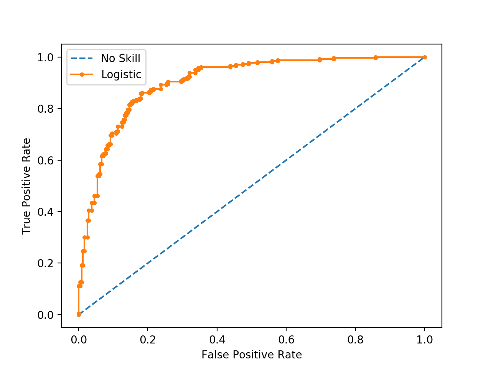

# Machine Learning Basics
A collection of ML interview questions.

## Data Preprocessing

**THREE STAGES TO BUILD ML MODELS**

- Design/ develop model + Train
- Test
- Apply/ Scale up for inference

**NLP PREPROCESS**
- **Sentense Segmentation** break the text apart into separate sentences.
- **Tokenization** break this sentence into separate words or tokens, easy in English, not in Chinese
- **Stemming** apples - apple
- **Lemmatization** ponies - pony, is - be, doing - do
- **Word Embedding** 
    - Frequency based Embedding
        - Count Vector
        - TF-IDF Vector
        - Co-Occurrence Vector
    - Prediction based Embedding

**MISSING/ CORRUPTED VALUE**
- Remove record if not much
- Replace with average or with 0 depending on the data

**DEALING WITH NUMERICAL + CATEGORICAL  FEATURES**

In general, a preferred approach is to convert all your features into standardized continuous features.
- For features that were originally continuous, perform standardization:
x_i = (x_i - mean(x)) / standard_deviation(x).
That is, for each feature, subtract the mean of the feature and then divide by the standard deviation of the feature. An alternative approach is to convert the continuous features into the range [0, 1]:
x_i = (x_i - min(x)) / (max(x) - min(x)).
- For categorical features, perform binarization on them so that each value is a continuous variable taking on the value of 0.0 or 1.0. For example, if you have a categorical variable "gender" that can take on values of MALE, FEMALE, and NA, create three binary binary variables IS_MALE, IS_FEMALE, and IS_NA, where each variable can be 0.0 or 1.0 One-Hot Encodings . You can then perform standardization as in step 1.
Now you have all your features as standardized continuous variables.

**POSITIVE NEGATIVE SAMPLE IMBALANCE**

An imbalanced dataset is one that has different proportions of target categories. For example, a dataset with medical images where we have to detect some illness will typically have many more negative samples than positive samples—say, 98% of images are without the illness and 2% of images are with the illness.
There are different options to deal with imbalanced datasets:
1.	Oversampling or undersampling. Instead of sampling with a uniform distribution from the training dataset, we can use other distributions so the model sees a more balanced dataset.
2.	Data augmentation. We can add data in the less frequent categories by modifying existing data in a controlled way. In the example dataset, we could flip the images with illnesses, or add noise to copies of the images in such a way that the illness remains visible.
3.	Using appropriate metrics. In the example dataset, if we had a model that always made negative predictions, it would achieve a precision of 98%. There are other metrics such as precision, recall, and F-score that describe the accuracy of the model better when using an imbalanced dataset.

**COMBAT THE CURSE OF DIMENSIONALITY?**
- Manual Feature Selection
- Principal Component Analysis (PCA)
- Multidimensional Scaling
- Locally linear embedding

**PCA**

projects the data into a lower dimensional space. Given the columns of X, 
are features with higher variance more important than features with lower variance


## Model Selection and Design

**CNN & RNN, WHICH ONE FOR NLP (BETTER AND FASTER)**
- long-term memory, then RNN. e.g. semantic extraction, answering a question like Alexa
- to extract more features and information, CNN. e.g. Name Entity Recognition (NER)

**ACTIVATION FUNCTION WHICH ONE FOR CNN**

Activation: linear-> nonlinear (for universal approximation)
If no activation, then is just multiplication(linear)
Need to be Differentiable: calculate the derivative

- Sigmoid(0, 1)/ tanh(-1, 1): vanishing gradient
- ReLU for hidden layers: solves vanishing gradient
- Leaky ReLU for hidden layers : solves dead Neurals(never updates)
- Softmax for output: probability for different classes – sum to 1
- Linear for output: for regression

**HOW TO CHOOSE THE NUMBER OF LAYERS OF NN?**

We need hidden layer iff the data are not linear separable. Multi-hidden layer could be used to model non-linearity. 
1-2 layers is enough for simple dataset.

- 没有隐藏层：仅能够表示线性可分函数或决策
- 隐藏层数=1：可以拟合任何“包含从一个有限空间到另一个有限空间的连续映射”的函数
- 隐藏层数=2：搭配适当的激活函数可以表示任意精度的任意决策边界，并且可以拟合任何精度的任何平滑映射
- 隐藏层数>2：多出来的隐藏层可以学习复杂的描述（某种自动特征工程）
层数越深，理论上拟合函数的能力增强，效果按理说会更好，但是实际上更深的层数可能会带来过拟合的问题，同时也会增加训练难度，使模型难以收敛。

**NUMBER OF NEURON IN EACH LAYER**

high - overfit, low - underfit
- 隐藏神经元的数量应在输入层的大小和输出层的大小之间。
- 隐藏神经元的数量应为输入层大小的2/3加上输出层大小的2/3。
- 隐藏神经元的数量考虑引入Batch Normalization, Dropout, 正则化等降低过拟合的方法。应小于输入层大小的两倍。
各个hidden layer 相同数目就行，或者递减，低层次提取更多的特征。

**BATCH NORM**

Training Deep Neural Networks is complicated by the fact that the distribution of each layer's inputs changes during training, 
as the parameters of the previous layers change. 
The idea is then to normalize the inputs of each layer in such a way that they have a mean output activation of zero and standard deviation of one. 
This is done for each individual mini-batch at each layer i.e compute the mean and variance of that mini-batch alone, then normalize. This is analogous to how the inputs to networks are standardized. 
- Normalizing the inputs to a network helps it learn. Thought of as a series of neural networks feeding into each other, 
we normalize the output of one layer before applying the activation function, and then feed it into the following layer.
- Reduce the influence of the preceding layers on the following ones.

**REGULARIZATION**
- **L1 Lasso**
shrink some coefficients to zero, performing variable selection.
- **L2 Ridge**
shrinks all the coefficient by the same proportions but eliminates none

**DROPOUT**

simple way to prevent overfitting. It is the dropping out of some of the units in a 
neural network. 

## Deep Learning Training
**HYPER PARAMETER TUNING: HOW**
- Grid search hyper parameters with XGboost, 
```
{"learning_rate"    : [0.05, 0.10, 0.15, 0.20, 0.25, 0.30 ] ,
 "max_depth"        : [ 3, 4, 5, 6, 8, 10, 12, 15],
 "min_child_weight" : [ 1, 3, 5, 7 ],
 "gamma"            : [ 0.0, 0.1, 0.2 , 0.3, 0.4 ],
 "colsample_bytree" : [ 0.3, 0.4, 0.5 , 0.7 ] }
```

- Monitor the learning curve, better not learn too quick

**MODEL ARCHITECTURE TUNING: HOW**
1.	Tune the #hidden neuron in the network to prevent underfit and overfit
2.	layers higher the easier to overfit but less tendency to underfit
3.	Batch norm and dropout to prevent overfit and help with convergence

**BATCH SIZE INFLUENCE**

SGD中的batch size， Batch size determines how many examples you look at before making a weight update.
The lower it is, the noisier the training signal is going to be(Here one-data point at a time hence the gradient is aggressive (noisy gradients) hence there is going to be lot of oscillations. So there is a chance that your oscillations can make the algorithm not reach a local minimum. (diverge).),
the higher it is, the longer it will take to compute the gradient for each step. (too high can prevent convergence)
Use grid search for batch size and lr or other optimizer like ADAM.

**VANISHING GRADIENT/ EXPLODING GRADIENT/ DEAD NEURONS**
1. Vanishing Gradient: As information is passed back, the gradients begin to vanish and become small relative to 
the weights of the networks.
Techniques inlcuding 
    - ReLU activation (they only saturate in one direction), could cause dead neurons (gradient be either 1 or 0)
    - Residual connections (allow gradient information to pass through the layers)
2. Exploding Gradient: Gradient too large which causes problems. could use gradient clipping.
3. Dead neurons: return 0 forever and never learn because the gradient is never passed through. 
Solve by LeakyReLU (gradient is non-zero everywhere)

**UNDERFIT/ OVERFIT, BIAS/ VARIANCE**
- The bias error is an error from erroneous assumptions in the learning algorithm. 
High bias can cause an algorithm to miss the relevant relations between features and target outputs (underfitting).
- The variance is an error from sensitivity to small fluctuations in the training set. 
High variance can cause an algorithm to model the random noise in the training data, 
rather than the intended outputs (overfitting).

**HOW TO PREVENT OVERFIT?**
- Simpler model: less parameters
- Dropout/ Regularization
- Cross validation


**CONFUSION MATRIX**

n=165 | Predicted No | Predicted Yes
--- | --- | ---
Actual No | 50 | 10
Actual Yes | 5 | 100
```
- False Positive = 10
- False Negative = 5
- True Positive = 100
- True Negative = 50
- Accuracy = 150/165
- Recall = 100/ 150
- Precision = 100/110 (打中多少)
- F1-Score = 2 * (precision * recall) / (precision + recall)
```

**EXPLAIN ROC CURVE**

```
True Positive Rate (sensitivity) = True Positives / (True Positives + False Negatives)
False Positive Rate = False Positives / (False Positives + True Negatives)
```

The ROC curve is a graphical representation of the contrast between true positive rates and the false positive rate at 
various thresholds. Need the Area Under Curve to be  large (AUC).



## Ensemble

**BAGGING**

e.g. bootstrap. random sample with replacement.，然后在每组样本上训练出来的模型取平均。
Bagging是降低方差，prevent overfit

**BOOSTING**

e.g. Adaboost. 根据当前模型损失函数负梯度信息来训练新加入的弱分类器，
然后将训练好的弱分类器以累加的形式结合到现有的模型中 prevent underfit


**WHY ENSEMBLE WORKS?**

An ensemble is the combination of multiple models to create a single prediction.
 The key idea for making better predictions is that the models should make 
 different errors. 
 That way the errors of one model will be compensated by the right guesses of 
 the other models and thus the score of the ensemble will be higher.

## System Design

**RECOMMENDER SYSTEM**

1.	Content based filter
2.	Collaborative filtering
